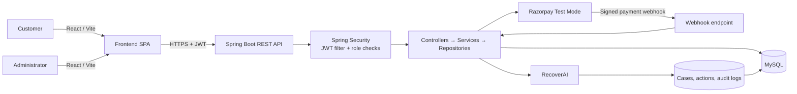
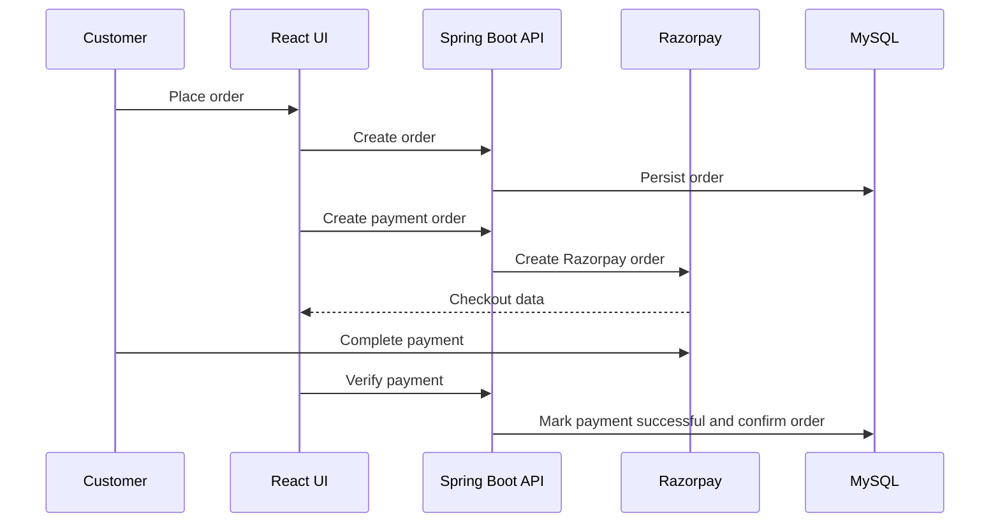

# NexCart

NexCart is a full-stack electronics e-commerce platform. It provides a customer shopping experience, an admin workspace, Razorpay test-mode payments, and **RecoverAI**—a controlled workflow for recovering failed payments.

## Highlights

- Secure registration and login with JWT authentication and BCrypt password hashing
- Product, category, brand, cart, wishlist, address, coupon, review, and order management
- Role-based customer and admin access
- Razorpay test-mode checkout and signed webhook processing
- Swagger/OpenAPI API documentation
- RecoverAI case tracking, guardrails, audit history, and isolated simulations

## Technology Stack

| Layer | Technologies |
| --- | --- |
| Frontend | React, Vite, React Router, Axios, Tailwind CSS |
| Backend | Java 21, Spring Boot, Spring Web, Spring Security, Spring Data JPA |
| Database | MySQL, Hibernate/JPA |
| Security | JWT, BCrypt, role-based authorization |
| Payments | Razorpay Java SDK, Razorpay webhooks |
| Tooling | Maven, JUnit, Mockito, npm, ESLint, Springdoc OpenAPI |

## Architecture



### Backend request flow

```text
Request → Controller → Service → Repository → MySQL
                     ↓
               DTO / Mapper response
```

Spring Security validates JWTs before protected routes reach controllers. Customers can access their own shopping and payment data; administrators can access `/api/admin/**`.

## Project Structure

```text
NexCart/
├── backend/
│   ├── config/          Security, Razorpay, OpenAPI configuration
│   ├── controller/      REST endpoints
│   ├── dto/             Request and response models
│   ├── entity/          JPA entities
│   ├── repository/      Data access
│   ├── security/        JWT authentication
│   ├── service/         Business logic
│   └── recovery/        RecoverAI module
├── frontend/
│   └── src/
│       ├── api/         API clients
│       ├── components/  Shared UI components
│       ├── context/     Authentication state
│       ├── pages/       Customer, auth, and admin pages
│       └── routes/      Routing and access guards
└── docs/                PRD and RecoverAI documentation
```

## Checkout Flow



## RecoverAI

RecoverAI is a bounded payment-recovery workflow, not an unrestricted AI agent.

```text
Payment failure
  → Recovery case created
  → Deterministic decision
  → Guardrail validation
  → Bounded action
  → Audit trail
  → Payment outcome
  → RECOVERED or terminal state
```

### How the decision engine works

The current implementation uses a clearly labeled `DETERMINISTIC_FALLBACK` decision service. It evaluates the failed payment amount and previous recovery attempts to recommend one typed action:

- `RETRY_PAYMENT`
- `CREATE_PAYMENT_LINK`
- `SEND_RECOVERY_MESSAGE`
- `NO_ACTION`

Each decision stores probability, expected recovery amount, confidence, risk level, reason, source, and guardrail result.

### Guardrails

- Terminal cases (`RECOVERED`, `CUSTOMER_CANCELLED`, `EXHAUSTED`, `FAILED`, `NO_ACTION`) cannot run additional actions.
- Recovery attempts are capped (default: 3).
- Equivalent pending/completed retry and link actions are not duplicated.
- Customer order cancellation stops recovery and cancels a linked Razorpay payment link where supported.
- Every state change and action is stored in the recovery audit trail.

### Real vs simulated recovery

| Mode | Behavior |
| --- | --- |
| **REAL** | Creates Razorpay test-mode payment links. A verified `payment_link.paid` webhook resolves the case to `RECOVERED`. |
| **SIMULATED** | Creates a `simulated://` demo link only. It never calls Razorpay, sends no customer notification, and does not update orders or payments. |

Simulated recovered amounts are explicitly labeled **SIMULATED** and excluded from real recovered-revenue metrics.

## Key API Endpoints

| Area | Base route | Examples |
| --- | --- | --- |
| Authentication | `/api/auth` | register, login |
| Products | `/api/products` | list, search, product detail |
| Customer shopping | `/api/cart`, `/api/wishlist`, `/api/orders` | cart, wishlist, checkout, orders |
| Payments | `/api/payments` | config, create-order, verify, failed |
| Admin | `/api/admin` | product, order, user, payment management |
| RecoverAI | `/api/admin/recovery` | metrics, cases, analyze, execute, simulate |
| Razorpay webhook | `/api/webhooks/razorpay` | signed payment and payment-link events |

OpenAPI documentation is available through Swagger UI while the backend is running.

## Local Setup

### Prerequisites

- Java 21+
- Maven 3.9+
- Node.js and npm
- MySQL 8+
- Razorpay test-mode credentials for real payment testing

### Configure environment

Create a MySQL database named `nexcart`. Provide local values for the following environment variables or Spring property overrides:

```properties
SPRING_DATASOURCE_URL=jdbc:mysql://localhost:3306/nexcart
SPRING_DATASOURCE_USERNAME=YOUR_DB_USER
SPRING_DATASOURCE_PASSWORD=YOUR_DB_PASSWORD
JWT_SECRET=YOUR_LONG_RANDOM_SECRET
RAZORPAY_KEY_ID=rzp_test_...
RAZORPAY_KEY_SECRET=YOUR_RAZORPAY_SECRET
RAZORPAY_WEBHOOK_SECRET=YOUR_WEBHOOK_SECRET
RECOVERY_MAX_ATTEMPTS=3
```

Use [`backend/.env.example`](backend/.env.example) as a variable reference. Never commit real credentials.

### Run locally

```bash
# Terminal 1 — backend
cd backend
mvn spring-boot:run

# Terminal 2 — frontend
cd frontend
npm install
npm run dev
```

- Frontend: `http://localhost:5173`
- Backend: `http://localhost:8080`

## Build and Test

```bash
# Backend tests
cd backend
mvn test

# Frontend production build
cd frontend
npm run build

# Frontend lint
npm run lint
```

## Documentation

- [Product requirements document](docs/PRD.md)
- [RecoverAI details](docs/RECOVERAI.md)
