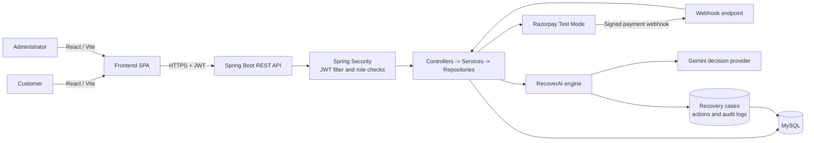
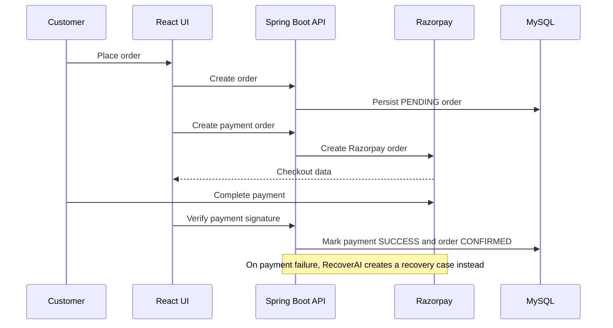
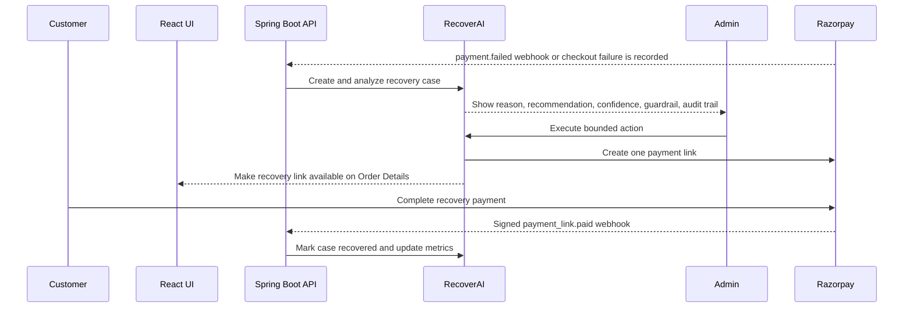

# NexCart | RecoverAI

> An electronics marketplace with **RecoverAI** - a built-in revenue recovery layer that detects failed payments, recommends safe interventions, and turns lost checkout intent into measurable recovered revenue.

## Why NexCart

Failed payments are a silent e-commerce revenue leak. A customer may still intend to buy, but a timeout, bank decline, or interrupted checkout leaves the order unfinished. Most products either stop at the failure or rely on an unrestricted AI agent to act on financial data.

NexCart closes the loop safely. Its **RecoverAI** module detects a failed payment, diagnoses the context, recommends one permitted intervention, applies backend guardrails, and measures whether revenue was actually recovered. AI informs the decision; deterministic application code controls execution.

## Product at a glance

| Audience | What they can do |
| --- | --- |
| **Visitor** | Browse products, brands, categories, product details, and reviews; register or sign in. |
| **Customer** | Search and filter products, manage cart and wishlist, save addresses, apply coupons, complete Razorpay checkout, view orders, and use an available recovery payment link. |
| **Admin** | Manage the catalog and operational data, inspect RecoverAI cases, review decisions and audit events, execute bounded actions, and monitor recovery metrics. |

### Core capabilities

- **Commerce:** product catalog, category and brand discovery, search, filtering, sorting, pagination, reviews, cart, wishlist, profile, addresses, coupons, and orders.
- **Payments:** Razorpay Test Mode checkout, server-side payment-signature verification, and signature-verified Razorpay webhooks.
- **Role protection:** JWT authentication, BCrypt password hashing, customer-owned data checks, and admin-only routes/APIs.
- **Operations:** catalog, category, brand, coupon, user, address, order, payment, and review administration APIs.
- **RecoverAI:** automatic failure detection, structured decisioning, guardrails, payment-link recovery, audit history, and real/simulated metrics.

## RecoverAI - bounded AI revenue recovery

RecoverAI follows a closed recovery loop:

```text
DETECT -> DIAGNOSE -> DECIDE -> ACT -> MEASURE
```

1. A checkout failure creates a persistent recovery case with the order amount and failure reason.
2. Gemini, when configured, receives a minimal structured recovery context and recommends one action. If it is unavailable or its response is invalid, deterministic rules take over.
3. The backend validates the recommendation and calculates expected recovery itself.
4. An admin executes the approved bounded action, such as creating one secure Razorpay payment link.
5. The customer completes the pending order through the link shown on their Order Details page.
6. A signed `payment_link.paid` webhook verifies the outcome, confirms the order, resolves the case, and updates real recovered revenue.

### Guardrails by design

- AI cannot directly move money, modify order values, change permissions, access the database, or invoke Razorpay.
- The decision contract permits only `RETRY_PAYMENT`, `CREATE_PAYMENT_LINK`, and `NO_ACTION`.
- Recovery attempts are capped at **3** by default; payment retries are capped at **2**.
- Equivalent pending or completed retry/payment-link actions are not duplicated.
- Terminal cases - `RECOVERED`, `CUSTOMER_CANCELLED`, `EXHAUSTED`, `FAILED`, and `NO_ACTION` - cannot receive another action.
- Cancelling an order stops recovery and attempts to cancel its linked Razorpay payment link.
- Every decision, guardrail result, action, and outcome is retained in the recovery audit trail.

### Real and simulated recovery

| Mode | Purpose and behavior |
| --- | --- |
| **REAL** | Creates a Razorpay Test Mode payment link. A signed payment-link webhook marks the payment successful, confirms the order, and adds to real recovered revenue. |
| **SIMULATED** | Runs the same recovery lifecycle with a `simulated://` link for safe demos. It never contacts Razorpay and is excluded from real recovered-revenue metrics. |

The admin recovery view reports revenue at risk, recovered revenue, expected recovery, recovery rate, detected/recovered cases, action distribution, case detail, and its audit timeline.

## Architecture

NexCart is a **modular monolith**: the commerce module and the dedicated `recovery` package share a secure Spring Boot application and MySQL database while retaining clear package boundaries.



### Successful payment flow



### Recovery payment flow



## Technology stack

| Layer | Technologies |
| --- | --- |
| Frontend | React 19, Vite, React Router 7, Axios, Tailwind CSS 4 |
| Backend | Java 21, Spring Boot 3.5, Spring Web, Spring Security, Spring Data JPA |
| Data | MySQL 8, Hibernate/JPA, MapStruct |
| Authentication | JWT and BCrypt with `CUSTOMER` / `ADMIN` authorization |
| Payments | Razorpay Java SDK, Razorpay Test Mode, payment and webhook signature verification |
| AI decisioning | Gemini `gemini-2.5-flash` with deterministic fallback |
| Quality and docs | JUnit, Mockito, ESLint, Maven, npm, Springdoc OpenAPI |

## Repository structure

```text
NexCart/
├── frontend/
│   └── src/
│       ├── api/              # Axios clients, including admin recovery APIs
│       ├── components/       # Shared storefront components
│       ├── context/          # Authentication state
│       ├── pages/            # customer, admin, and auth screens
│       └── routes/           # Protected and admin-only routes
├── backend/
│   └── src/main/java/com/nexcart/
│       ├── controller/       # REST API endpoints
│       ├── dto/ and mapper/  # Request/response models and mapping
│       ├── entity/           # Commerce JPA entities
│       ├── repository/       # Persistence layer
│       ├── security/         # JWT authentication and user details
│       ├── service/          # Commerce business logic
│       └── recovery/         # RecoverAI AI, service, entities, APIs, webhooks
└── docs/
    ├── PRD.md
    └── RECOVERAI.md
```

## Run locally

### Prerequisites

- Java 21+
- Maven 3.9+
- Node.js and npm
- MySQL 8+
- Razorpay Test Mode credentials
- Optional: Gemini API key

### Configuration

Create a MySQL database named `nexcart`. Configure the following environment variables; see [`backend/.env.example`](backend/.env.example) for placeholders.

```properties
SPRING_DATASOURCE_URL=jdbc:mysql://localhost:3306/nexcart
SPRING_DATASOURCE_USERNAME=YOUR_DB_USER
SPRING_DATASOURCE_PASSWORD=YOUR_DB_PASSWORD
JWT_SECRET=YOUR_LONG_RANDOM_SECRET
RAZORPAY_KEY_ID=rzp_test_...
RAZORPAY_KEY_SECRET=YOUR_RAZORPAY_SECRET
RAZORPAY_WEBHOOK_SECRET=YOUR_WEBHOOK_SECRET
RECOVERY_MAX_ATTEMPTS=3
GEMINI_API_KEY=YOUR_GEMINI_API_KEY
GEMINI_MODEL=gemini-2.5-flash
```

```bash
# Terminal 1 - backend
cd backend
mvn spring-boot:run

# Terminal 2 - frontend
cd frontend
npm install
npm run dev
```

| Service | URL |
| --- | --- |
| Frontend | `http://localhost:5173` |
| Backend | `http://localhost:8080` |
| Swagger UI | `http://localhost:8080/swagger-ui.html` |

To demonstrate real recovery payment completion, configure Razorpay to send signed events to `POST /api/webhooks/razorpay` and set the same `RAZORPAY_WEBHOOK_SECRET` in the backend.

## Verification

```bash
cd backend
mvn test

cd ../frontend
npm run lint
npm run build
```

## Security

- Never commit JWT, database, Razorpay, or Gemini secrets. Use environment variables and rotate exposed test credentials.
- Customer APIs are protected by role checks and ownership validation; `/api/admin/**` requires the `ADMIN` role.
- Payment and webhook signatures are verified before payment, order, or recovery state changes.

---

NexCart demonstrates AI revenue recovery with a practical constraint: the system does not merely identify money at risk - it recovers it through controlled actions, stopping rules, and a measurable audit trail.
 
