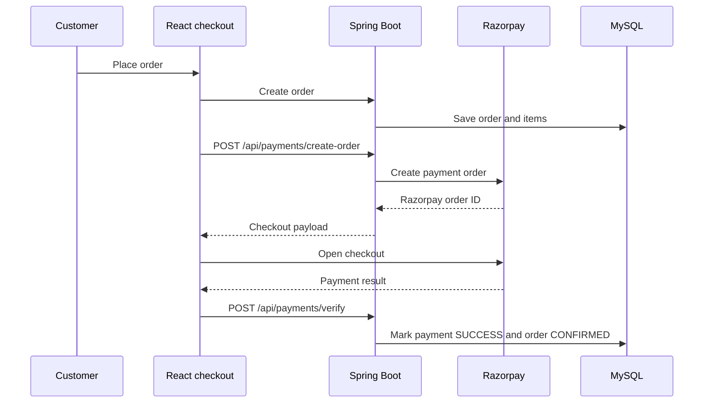
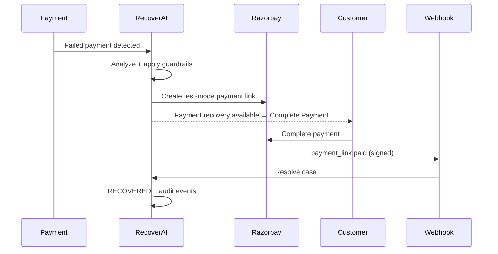

# NexCart

NexCart is a full-stack electronics commerce application with a React customer/admin interface, a Spring Boot REST API, MySQL persistence, Razorpay test-mode payments, and RecoverAI: a bounded payment-recovery workflow.

> **Project status.** This README documents the application as it exists in this repository. The product requirements document includes additional roadmap ideas (for example, natural-language product search and recommendations) that are not presented here as implemented features.

## What it does

### Customer capabilities

- Register and sign in with JWT-based authentication.
- Browse products, categories, and brands; view product details and reviews.
- Manage cart, wishlist, profile, and delivery addresses.
- Place an order, apply coupons, and complete Razorpay checkout.
- View orders and order details.
- Use a secure recovery payment link when an eligible payment recovery link is available.

### Administrator capabilities

- Manage products, brands, categories, coupons, users, addresses, reviews, payments, and orders through the protected admin workspace.
- View RecoverAI cases, decision details, guardrail results, actions, and audit history.
- Filter recovery data by **REAL** and **SIMULATED** cases.
- Run an isolated simulation that never contacts Razorpay or counts toward real recovered revenue.

## Architecture

```mermaid
flowchart LR
    C[Customer browser] -->|React / Vite| FE[Frontend SPA]
    A[Administrator browser] -->|React / Vite| FE
    FE -->|Axios + JWT| API[Spring Boot REST API]

    API --> SEC[Spring Security\nJWT filter + role authorization]
    SEC --> APP[Controllers → Services → Mappers → Repositories]
    APP --> DB[(MySQL)]
    APP --> RP[Razorpay Test Mode]
    RP -->|signed webhooks| WH[/api/webhooks/razorpay]
    WH --> APP

    APP --> RAI[RecoverAI]
    RAI --> RC[(Recovery cases, actions, audit logs)]
    RC --> DB
```

### Backend layering

```text
HTTP request
  └─ Controller       REST endpoint, request/response handling
      └─ Service      business rules, ownership checks, transactions
          └─ Mapper   entity ↔ DTO transformation (MapStruct/manual mappers)
              └─ Repository  Spring Data JPA persistence
                  └─ MySQL
```

The recovery module follows the same pattern, under `com.nexcart.recovery`, with dedicated case/action/audit entities, repositories, controllers, decision service, and webhook handler.

## Technology stack

| Area | Technologies |
| --- | --- |
| Frontend | React 19, Vite, React Router, Axios, Tailwind CSS, React Hot Toast, React Icons |
| Backend | Java 21, Spring Boot 3.5, Spring Web, Spring Data JPA, Spring Security, Spring Validation |
| Persistence | MySQL, Hibernate/JPA |
| Security | JWT (`jjwt`), BCrypt password hashing, role-based authorization, CORS configuration |
| Payments | Razorpay Java SDK and Razorpay signed webhooks |
| API documentation | Springdoc OpenAPI / Swagger UI |
| Build and test | Maven, JUnit 5, Mockito, npm, ESLint |
| Supporting dependencies | Redis and mail starters are included for supporting/incremental capabilities |

## Repository layout

```text
NexCart/
├── backend/
│   ├── src/main/java/com/nexcart/
│   │   ├── controller/       REST controllers
│   │   ├── service/          business services and implementations
│   │   ├── entity/           JPA domain entities
│   │   ├── repository/       Spring Data repositories
│   │   ├── dto/              request and response contracts
│   │   ├── mapper/           entity-to-DTO mapping
│   │   ├── security/         JWT authentication support
│   │   ├── config/           security, Razorpay, OpenAPI configuration
│   │   └── recovery/         RecoverAI module
│   └── src/test/             Spring Boot and recovery tests
├── frontend/
│   └── src/
│       ├── pages/            customer, auth, and admin pages
│       ├── components/       reusable UI components
│       ├── api/              Axios API clients
│       ├── context/          authentication state
│       └── routes/           public, protected, and admin routes
└── docs/
    ├── PRD.md                product requirements and roadmap
    └── RECOVERAI.md          RecoverAI feature overview
```

## Core request flow

1. The React SPA makes requests through Axios.
2. Protected requests carry the JWT issued during authentication.
3. `JwtAuthenticationFilter` resolves the user and Spring Security enforces public, customer, or admin access.
4. A controller validates input and delegates to a service.
5. The service applies business rules and uses repositories to read/write MySQL.
6. A mapper returns a frontend-facing response DTO.

Role boundaries include:

- Public: authentication, product/brand/category reads, Swagger, and Razorpay webhook ingress.
- Customer: profile, cart, wishlist, address, order, payment, and review APIs.
- Admin: `/api/admin/**` management and RecoverAI APIs.

## Checkout and payment flow



If checkout fails, the payment failure path creates a recovery case. Razorpay webhook events provide an additional, signed server-to-server update path.

## RecoverAI

RecoverAI is intentionally a **bounded decision and recovery system**, not an unrestricted agent. Its lifecycle is:

```text
Payment failure
  → Recovery case detected
  → Deterministic analysis and recommendation
  → Guardrail validation
  → One bounded action
  → Audit events and customer recovery notification (when a real link exists)
  → Payment or webhook outcome
  → RECOVERED or terminal outcome
```

### Decision engine

The current `DeterministicAIRecoveryService` is explicitly recorded as `DETERMINISTIC_FALLBACK`; it does not claim to be a generative-AI decision.

It calculates a recovery probability and chooses one of these typed actions:

- `RETRY_PAYMENT`
- `CREATE_PAYMENT_LINK`
- `SEND_RECOVERY_MESSAGE`
- `NO_ACTION`

The decision considers payment amount and earlier action attempts. For example, higher-value failures are directed to a secure payment link, while retry limits lead to a bounded reminder. The result includes a reason, confidence, risk level, expected recovery amount, and decision source.

### Guardrails and idempotency

Recovery actions are enforced by the backend, not only by the UI:

- Cases in `RECOVERED`, `CUSTOMER_CANCELLED`, `EXHAUSTED`, `FAILED`, or `NO_ACTION` cannot execute another action.
- Recovery attempts are capped by `recovery.max-attempts` (default: `3`).
- Equivalent completed or pending retry/link actions are skipped.
- A live real payment link prevents unnecessary duplicate Razorpay links.
- Cancelling an order changes its recovery case to `CUSTOMER_CANCELLED` and attempts to cancel any associated Razorpay payment link.
- Every material event is stored in the recovery audit trail.

### REAL recovery flow



The webhook endpoint verifies `X-Razorpay-Signature` against the configured webhook secret before it accepts an event. A real recovered amount is counted only in real recovery metrics.

### SIMULATED recovery flow

Simulations are deliberately segregated from Razorpay and real business metrics:

1. The admin creates a simulated case.
2. Executing `CREATE_PAYMENT_LINK` creates a `simulated://` demo link only.
3. No Razorpay payment link, checkout, webhook, customer notification, order update, or payment-gateway request is created.
4. The audit trail records `SIMULATED_ACTION_PENDING`, `SIMULATED_PAYMENT_LINK_CREATED`, `SIMULATED_PAYMENT_SUCCESSFUL`, and `SIMULATED_RECOVERY_COMPLETED` as applicable.
5. The case resolves to `RECOVERED` as a demo outcome, but its amount is labeled **SIMULATED** and excluded from REAL recovered revenue.

The admin UI labels simulated cases, amounts, and outcomes. In **ALL** mode, real financial metrics and simulated recovered amounts are presented separately.

### Recovery endpoints

All administrative recovery endpoints require the `ADMIN` role.

| Method | Endpoint | Purpose |
| --- | --- | --- |
| `GET` | `/api/admin/recovery/metrics` | Recovery metrics; accepts `mode=ALL`, `REAL`, or `SIMULATED` |
| `GET` | `/api/admin/recovery/cases` | List recovery cases |
| `GET` | `/api/admin/recovery/cases/{id}` | Case detail, actions, and audit trail |
| `POST` | `/api/admin/recovery/cases/{id}/analyze` | Run/re-run analysis for a non-terminal case |
| `POST` | `/api/admin/recovery/cases/{id}/execute` | Execute the approved bounded action |
| `POST` | `/api/admin/recovery/simulate` | Create an isolated demo case |
| `POST` | `/api/webhooks/razorpay` | Receive signed Razorpay payment events |

## Local setup

### Prerequisites

- Java 21+
- Maven 3.9+
- Node.js and npm
- MySQL 8+
- Razorpay test-mode credentials for real payment testing

### 1. Configure the backend

Create a MySQL database named `nexcart`, then supply local credentials and secrets as environment variables (or equivalent Spring property overrides). Do not commit real secrets.

```properties
SPRING_DATASOURCE_URL=jdbc:mysql://localhost:3306/nexcart
SPRING_DATASOURCE_USERNAME=YOUR_DB_USER
SPRING_DATASOURCE_PASSWORD=YOUR_DB_PASSWORD

JWT_SECRET=use_a_long_random_secret
RAZORPAY_KEY_ID=rzp_test_...
RAZORPAY_KEY_SECRET=...
RAZORPAY_WEBHOOK_SECRET=...
RECOVERY_MAX_ATTEMPTS=3
```

The repository includes [`backend/.env.example`](backend/.env.example) as a variable-name reference. If you use a `.env` file locally, load it through your IDE, shell, or deployment environment; Spring Boot does not automatically import that file. Rotate any credentials that may have been stored in local configuration before sharing or deploying the project.

### 2. Start the backend

```bash
cd backend
mvn spring-boot:run
```

The API runs on `http://localhost:8080` by default. Swagger/OpenAPI is available through the Springdoc UI when the backend is running.

### 3. Start the frontend

```bash
cd frontend
npm install
npm run dev
```

Vite serves the application on `http://localhost:5173` by default. The backend CORS configuration allows this local origin.

## Build and test

```bash
# Backend
cd backend
mvn test

# Frontend production build
cd ../frontend
npm run build

# Frontend lint
npm run lint
```

## Security notes

- Authentication is stateless; the client supplies its JWT on protected requests.
- Passwords are stored using BCrypt.
- Customer ownership checks protect customer payment/order access in the service layer.
- Admin APIs are role protected.
- Razorpay webhook requests are signature-verified.
- Keep database passwords, JWT secrets, Razorpay key secrets, and webhook secrets outside version control in real deployments.
- Update the development-only CORS origin and security logging settings before production deployment.

## Documentation

- [Product requirements and roadmap](docs/PRD.md)
- [RecoverAI overview](docs/RECOVERAI.md)
