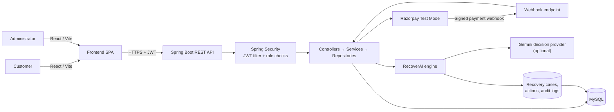
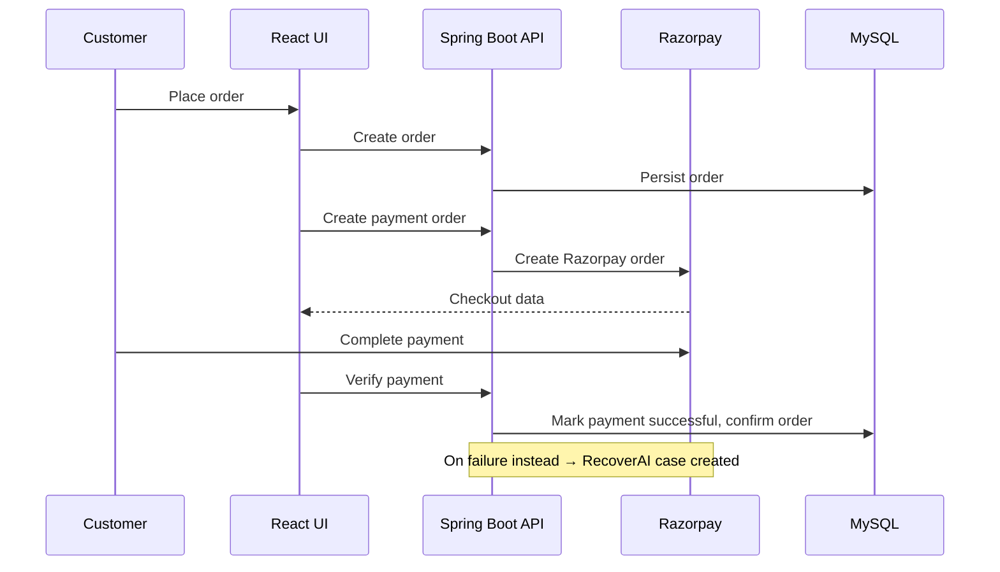

# NexCart 🛒 — with RecoverAI
 
**Full-stack electronics e-commerce platform with an AI-assisted failed-payment recovery engine.**
Built for **Razorpay Buildathon — Track 03**.
 
[]()
[]()
[]()
[]()
[]()
 
---
 
## Table of Contents
 
1. [Problem Statement & Track Alignment](#1-problem-statement--track-alignment)
2. [Solution Overview](#2-solution-overview)
3. [Core Features](#3-core-features)
4. [System Architecture](#4-system-architecture)
5. [RecoverAI — Deep Dive](#5-recoverai--deep-dive)
6. [Checkout & Payment Flow](#6-checkout--payment-flow)
7. [Technology Stack](#7-technology-stack)
8. [Project Structure](#8-project-structure)
9. [API Reference](#9-api-reference)
10. [Getting Started](#10-getting-started)
11. [Build & Test](#11-build--test)
12. [Security Notes](#12-security-notes)
13. [Documentation](#13-documentation)
---
 
## 1. Problem Statement & Track Alignment
 
Payment failures are one of the largest silent revenue leaks in e-commerce checkout. Most platforms either do nothing after a failed payment or hand the problem to an unrestrained AI agent that can take unpredictable action on money and orders.
 
**Track 03** calls for a bounded, auditable recovery workflow rather than an open-ended agent. NexCart's answer is **RecoverAI** — a payment-recovery module that reasons about *why* a payment failed and *what to do next*, but is never allowed to move money, change orders, or touch access control on its own. Every decision is validated and executed by deterministic backend code, and every action is logged.
 
## 2. Solution Overview
 
NexCart is a two-role (**Customer** / **Admin**) electronics marketplace: browsing, cart, wishlist, coupons, checkout, and order management on the customer side; full catalog and operations management on the admin side. Razorpay powers checkout in test mode. When a payment fails, RecoverAI creates a case, decides on a bounded action (retry, payment link, or no action), executes it under guardrails, and tracks the outcome through to recovery — all visible from an admin-only Recovery dashboard with a safe simulation mode for demos.
 
## 3. Core Features
 
| Area | Capabilities |
| --- | --- |
| **Auth & Security** | JWT-based authentication, BCrypt password hashing, role-based route protection (`CUSTOMER` / `ADMIN`) |
| **Catalog** | Products, categories, brands, search/filter, product reviews |
| **Shopping** | Cart, wishlist, saved delivery addresses, coupon codes at checkout |
| **Orders & Payments** | Order lifecycle, Razorpay test-mode checkout, signed webhook verification, order cancellation |
| **Admin Workspace** | Manage products, categories, brands, users, addresses, coupons, reviews, orders, payments |
| **RecoverAI** | Automatic case creation on payment failure, AI-assisted decisioning, guardrails, audit trail, real vs. simulated recovery, recovery metrics dashboard |
| **API Docs** | Swagger / OpenAPI, generated live from the running backend |
 
## 4. System Architecture
 

 
**Request flow:** `Controller → Service → Repository → MySQL`, with the response mapped through a DTO/Mapper layer. Spring Security's JWT filter validates every protected request before it reaches a controller — customers can only reach their own shopping/payment data, and `/api/admin/**` is restricted to the `ADMIN` role.
 
The backend is a single **modular monolith** (not microservices): a core e-commerce module (`controller` / `service` / `repository` / `entity`) and a self-contained `recovery` package that implements RecoverAI, sharing the same database and security layer.
 
## 5. RecoverAI — Deep Dive
 
RecoverAI is a **bounded** recovery workflow, not an autonomous agent — it can recommend and execute only from a fixed, backend-enforced action set.
 
```text
DETECT → DIAGNOSE → DECIDE → ACT → MEASURE
 
Payment failure
  → Recovery case created (status: DETECTED)
  → Decision engine runs (Gemini or deterministic fallback)
  → Guardrail validation
  → Bounded action executed
  → Audit trail entry written
  → Payment outcome observed
  → Case resolves to RECOVERED or a terminal state
```
 
**Decision engine.** When `GEMINI_API_KEY` is configured, RecoverAI sends Gemini a minimal, non-PII recovery context and receives one structured recommendation. The backend independently validates the response, computes the expected recovery amount itself, and applies all guardrails before anything runs. If Gemini is unavailable, times out, or returns malformed/invalid output, a clearly labeled **`DETERMINISTIC_FALLBACK`** provider takes over so recovery never stalls.
 
**Possible actions:** `RETRY_PAYMENT` · `CREATE_PAYMENT_LINK` · `NO_ACTION` (with `SEND_RECOVERY_MESSAGE` modeled for future use).
Each decision persists: probability, expected recovery amount, confidence, risk level, reason, source (`GEMINI` / `DETERMINISTIC_FALLBACK`), and guardrail result.
 
**Guardrails:**
- Terminal cases (`RECOVERED`, `CUSTOMER_CANCELLED`, `EXHAUSTED`, `FAILED`, `NO_ACTION`) can never receive another action.
- Recovery attempts are capped (default: **3**); payment retries are capped at **2**.
- Equivalent pending/completed retry or payment-link actions are never duplicated.
- Gemini cannot touch money, orders, access control, or the database — it only returns a recommendation.
- Customer cancellation halts recovery and cancels any linked Razorpay payment link.
- Every state transition and action is written to an append-only audit log.
**Real vs. simulated:**
 
| Mode | Behavior |
| --- | --- |
| **REAL** | Creates an actual Razorpay test-mode payment link; a signed `payment_link.paid` webhook resolves the case to `RECOVERED`. |
| **SIMULATED** | Creates a `simulated://` demo link only — never calls Razorpay, sends no customer notification, and is excluded from real recovered-revenue metrics. |
 
Admins can drive both modes from the `/admin/recovery` screen, and metrics (at-risk revenue, recovered revenue, recovery rate, expected recovery, action distribution) can be filtered by real vs. simulated data.
 
## 6. Checkout & Payment Flow
 

 
## 7. Technology Stack
 
| Layer | Technologies |
| --- | --- |
| **Frontend** | React 19, Vite, React Router 7, Axios, Tailwind CSS 4 |
| **Backend** | Java 21, Spring Boot 3.5, Spring Web, Spring Security, Spring Data JPA |
| **Database** | MySQL 8, Hibernate / JPA |
| **Auth** | JWT (jjwt), BCrypt, role-based authorization |
| **Payments** | Razorpay Java SDK, signature-verified webhooks |
| **AI Decisioning** | Gemini API (`gemini-2.5-flash`) with deterministic rule-based fallback |
| **Docs & Mapping** | Springdoc OpenAPI (Swagger UI), MapStruct |
| **Tooling** | Maven, JUnit, Mockito, npm, ESLint |
 
## 8. Project Structure
 
```text
NexCart/
├── backend/
│   ├── config/            Security, Razorpay, OpenAPI configuration
│   ├── controller/        REST endpoints
│   ├── dto/                request/ and response/ models
│   ├── entity/             JPA entities
│   ├── repository/         Spring Data repositories
│   ├── security/           JWT filter, entry point, user details service
│   ├── service/ + impl/     Business logic
│   ├── specification/      JPA Specifications (product filtering)
│   ├── exception/           Domain exceptions + global handler
│   └── recovery/            RecoverAI module
│       ├── ai/               Gemini + deterministic decision providers
│       ├── controller/       Recovery + webhook endpoints
│       ├── service/           Case lifecycle & guardrails
│       ├── entity/ enums/     RecoveryCase, RecoveryAction, RecoveryAuditLog
│       └── dto/               Recovery context & decision models
├── frontend/
│   └── src/
│       ├── api/              Axios clients (incl. api/admin/)
│       ├── components/       Shared UI components
│       ├── context/          Auth state (AuthContext)
│       ├── pages/             customer/, admin/, auth/
│       └── routes/            ProtectedRoute, AdminRoute
└── docs/
    ├── PRD.md                Product requirements document
    └── RECOVERAI.md          RecoverAI technical reference
```
 
## 9. API Reference
 
| Area | Base route | Examples |
| --- | --- | --- |
| Authentication | `/api/auth` | register, login |
| Products | `/api/products` | list, search, product detail |
| Customer shopping | `/api/cart`, `/api/wishlist`, `/api/orders` | cart, wishlist, checkout, orders |
| Payments | `/api/payments` | config, create-order, verify, failed |
| Admin | `/api/admin/**` | product, order, user, payment management |
| **RecoverAI** | `/api/admin/recovery` | `GET /metrics`, `GET /cases`, `GET /cases/{id}`, `POST /cases/{id}/analyze`, `POST /cases/{id}/execute`, `POST /simulate` |
| Razorpay webhook | `/api/webhooks/razorpay` | signed payment & payment-link events |
 
Full interactive documentation is available via **Swagger UI** while the backend is running.
 
## 10. Getting Started
 
### Prerequisites
 
- Java 21+
- Maven 3.9+
- Node.js + npm
- MySQL 8+
- Razorpay test-mode credentials
- (Optional) Gemini API key — RecoverAI works without one via the deterministic fallback
### Configure environment
 
Create a MySQL database named `nexcart`, then set the following (see `backend/.env.example`):
 
```properties
SPRING_DATASOURCE_URL=jdbc:mysql://localhost:3306/nexcart
SPRING_DATASOURCE_USERNAME=YOUR_DB_USER
SPRING_DATASOURCE_PASSWORD=YOUR_DB_PASSWORD
JWT_SECRET=YOUR_LONG_RANDOM_SECRET
RAZORPAY_KEY_ID=rzp_test_...
RAZORPAY_KEY_SECRET=YOUR_RAZORPAY_SECRET
RAZORPAY_WEBHOOK_SECRET=YOUR_WEBHOOK_SECRET
RECOVERY_MAX_ATTEMPTS=3
GEMINI_API_KEY=YOUR_GEMINI_API_KEY
GEMINI_MODEL=gemini-2.5-flash
```
 
> Never commit real credentials — use environment variables or a local, git-ignored `.env`.
 
### Run locally
 
```bash
# Terminal 1 — backend
cd backend
mvn spring-boot:run
 
# Terminal 2 — frontend
cd frontend
npm install
npm run dev
```
 
- Frontend → `http://localhost:5173`
- Backend → `http://localhost:8080`
- Swagger UI → `http://localhost:8080/swagger-ui.html`
## 11. Build & Test
 
```bash
# Backend tests
cd backend
mvn test
 
# Frontend production build
cd frontend
npm run build
 
# Frontend lint
npm run lint
```
 
## 12. Security Notes
 
- `backend/src/main/resources/application.properties` currently checks in the DB password and Razorpay test key/secret directly — before your buildathon submission, move these to environment variables (they're already read from `${...}` placeholders in some fields) and rotate the exposed test keys.
- `jwt.secret`, `razorpay.key-secret`, `gemini.api-key` should always come from environment variables in any deployed environment, never from source control.
## 13. Documentation
 
- [Product Requirements Document](docs/PRD.md)
- [RecoverAI Technical Reference](docs/RECOVERAI.md)
---
 
<p align="center"><i>Built for Razorpay Buildathon — Track 03: Bounded AI-Assisted Payment Recovery</i></p>
 
